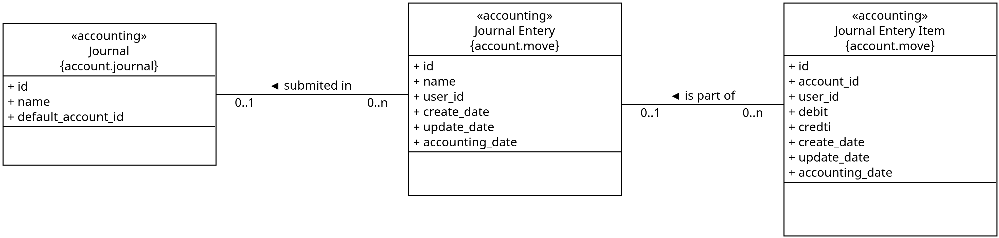

زبان حسابداری: بدهکار و بستانکار
=================================

از دید طراحی سیستم، حسابداری یک مدل داده‌ای منظم برای ثبت و تحلیل رویدادهای مالی است.
این مدل در نرم‌افزارهای مدرن مانند ``Odoo`` نیز با همان منطق کلاسیک اما با پیاده‌سازی
دقیق‌تر و کنترل‌های سیستمی اجرا می‌شود.

ساختار داده‌ای ثبت رویدادها
----------------------------

برای ثبت هر رویداد مالی، معمولاً با سه سطح داده‌ای روبه‌رو هستیم:

#. ``Journal Item`` (سطر سند)
#. ``Journal Entry`` (سند حسابداری)
#. ``Journal`` (روزنامه)

هر رویداد ابتدا به چند سطر حسابداری شکسته می‌شود، سپس در قالب یک سند ذخیره می‌شود و
سند در یک روزنامه مشخص طبقه‌بندی می‌گردد.

منطق بدهکار و بستانکار
-----------------------

هر رویداد مالی حداقل بر دو حساب اثر می‌گذارد؛ به همین دلیل ثبت‌ها در حسابداری
دوطرفه انجام می‌شوند. برای بیان این اثر از زبان بدهکار و بستانکار استفاده می‌کنیم.

قاعده پایه برای حساب‌های اصلی چنین است:

دارایی‌ها
    افزایش → بدهکار
    کاهش → بستانکار

بدهی‌ها
    افزایش → بستانکار
    کاهش → بدهکار

سرمایه
    افزایش → بستانکار
    کاهش → بدهکار

.. important::

    «بدهکار» یا «بستانکار» بودن به‌تنهایی خوب یا بد نیست؛ معنا همیشه به ماهیت
    حساب بستگی دارد. برای مثال، بستانکار شدن حساب بدهی یعنی افزایش تعهدات، اما
    بستانکار شدن حساب دارایی یعنی کاهش منابع.

مثال کوتاه
-----------

اگر شرکت از بانک وام دریافت کند:

- وجه نقد (دارایی) افزایش می‌یابد → بدهکار
- وام پرداختنی (بدهی) افزایش می‌یابد → بستانکار

بنابراین ثبت متوازن خواهد بود و جمع بدهکار و بستانکار برابر می‌ماند.
